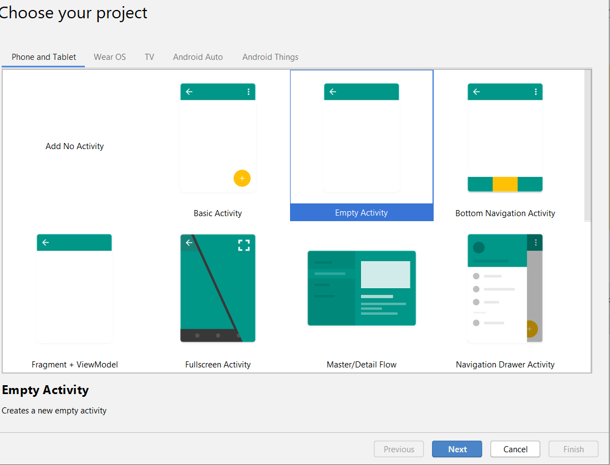
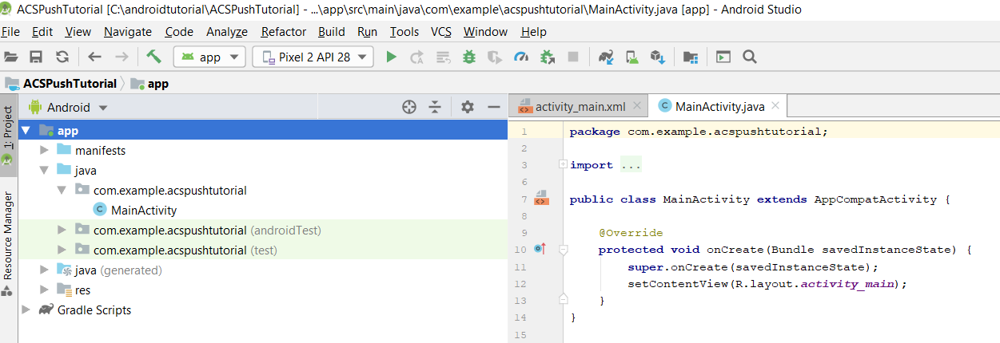
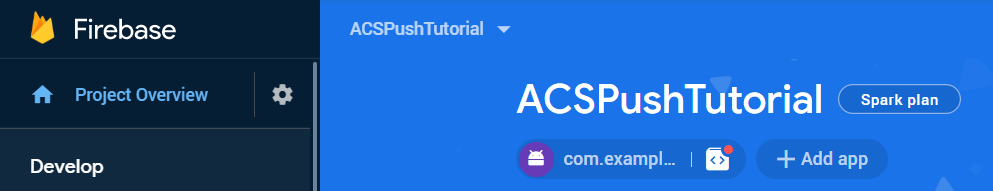
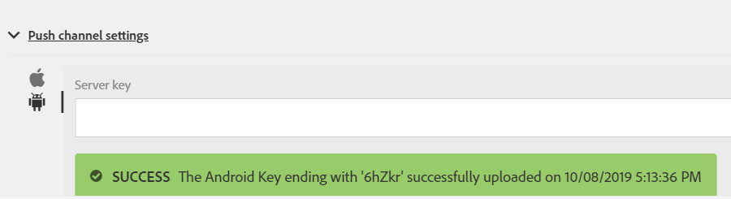

# Creating Android App and Configuring to use Firebase Cloud Messaging

In this part, you are creating Android App to receive push notifications sent from Adobe Campaign Standard. To receive the push notifications, app needs to be registered with Google's Firebase Cloud Service.

1. Login to your Firebase account. 
  
   Firebase is Google's mobile platform that helps you quickly develop high-quality apps. If you do not have Firebase account, please create one [from here](https://firebase.google.com).
  
1. Launch Android Studio.
1. Click **[!UICONTROL File]** > **[!UICONTROL New]** > **[!UICONTROL New Project].**
1. Select **[!UICONTROL Empty Activity]** and click **[!UICONTROL Next].**

   

1. Provide a meaningful name to the project. 

   For the purpose of this demo we have named our project, "ACSPushTutorial."
 
    

1. Accept the default package names and click **[!UICONTROL Finish]** to create your project.
   
   Your project structure should look similar to the following screen shot:
 
   

1. Click **[!UICONTROL Tools]** > **[!UICONTROL Firebase].** (This adds the project to Firebase.)
1. Click **[!UICONTROL Set up Firebase Cloud Messaging].**
    
   

1. Click **[!UICONTROL Connect to Firebase].**
1. After your app is connected to Firebase, click **[!UICONTROL Add FCM to your app].**
1. Click **[!UICONTROL Accept Changes].** 

   (When you are adding FCM to your app, the wizard needs your permission to make some changes to your project.)

   

1. On successful integration of your app with Firebase, you should get a message like the one shown below:
 
1. [Make sure your project is listed in Firebase console](https://console.firebase.google.com/)

## Configure Push Channel Settings

1. Login to the Firebase console
1. Open the **[!UICONTROL ACSPushTutorial]** project. 
1. Click the gear icon and open the project settings 

1. Tab to the **[!UICONTROL Cloud Messaging]** tab. 
1. Copy the server key.

1. Login to your Adobe Campaign Standard instance.
1. Click **[!UICONTROL Adobe Campaign]** > **[!UICONTROL Administration]** > **[!UICONTROL Channels]** > **[!UICONTROL Mobile App].**
1. Select the appropriate **[!UICONTROL Mobile Application Property].**
1. Click the [!DNL Android] icon in the **[!UICONTROL Push Channel settings]** section
1. Paste the server key in the Server key field. 

If everything goes well, you should see a SUCCESS message.

To summarize, we have created Android App and connected the Android App with Firebase. We then connected the Mobile App with the Android App by pasting the [!DNL Android] App's server key in to the Mobile App in Adobe Campaign Standard.
