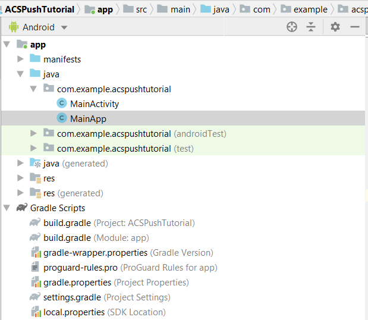

# Integrate Mobile SDK with Android App

In this part, we will integrate the Android app with Mobile SDK. To integrate mobile SDK with the Android app, please follow the following steps:

* Open the ACSPushTutorial project in Android Studio
* Create a new java class called MainApp which extends android.app.Application
* Your project structure at this point should look like below



* Expand the Gradle Scripts folder. Double click the build.gradle of the module. Paste the following dependencies in to the dependencies section of the build.gradle file. Your build.gradle file should now look like below

```java{.line-numbers}
implementation 'com.adobe.marketing.mobile:campaign:1.+'
implementation 'com.adobe.marketing.mobile:userprofile:1.+'
implementation 'com.adobe.marketing.mobile:sdk-core:1.+'
```


* Sync your Android project by clicking on the sync now button to sync your project

## Modify AndroidManifest.xml

Open AndroidManifest.xml and paste the following 2 lines after the manifest element and before the application element. This enables your app to communicate with outside world

```xml{.line-numbers}
<uses-permission android:name="android.permission.INTERNET" />
<uses-permission android:name="android.permission.ACCESS_NETWORK_STATE" />

```

copy the following line in the application element
android:name=".MainApp"
Save your AndroidManifest.xml
Your AndroidManifest.xml should look like this

```xml{.line-numbers}

<?xml version="1.0" encoding="utf-8"?>
<manifest xmlns:android="http://schemas.android.com/apk/res/android"
    package="com.example.acspushtutorial">
    <uses-permission android:name="android.permission.INTERNET" />
    <uses-permission android:name="android.permission.ACCESS_NETWORK_STATE" />

<application
    android:name=".MainApp"
    android:allowBackup="true"
    android:icon="@mipmap/ic_launcher"
    android:label="@string/app_name"
    android:roundIcon="@mipmap/ic_launcher_round"
    android:supportsRtl="true"
    android:theme="@style/AppTheme">

<activity android:name=".MainActivity">
<intent-filter>
    <action android:name="android.intent.action.MAIN" />
    <category android:name="android.intent.category.LAUNCHER" />
</intent-filter>
</activity>
</application>

</manifest>
```

