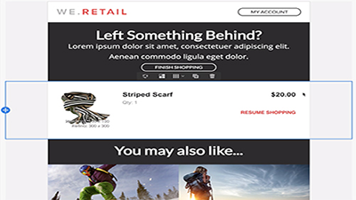

# Overview

Adobe Campaign provides a platform for designing cross-channel customer experiences and provides an environment for visual campaign orchestration, real time interaction management and cross channel execution. This user guide contains videos and tutorials on the many features and capabilities of Adobe Campaign Standard.

## What's new

* **[Profile Substitution - Testing email messages using targeted profiles](/help/communication-channels/email/profile-substitution.md)**
   
    *Learn how to send a proof for review with the exact representation of the message that the profile will receive.*

* **[Control Panel - Google TXT record management](/help/administrating/control-panel/google-txt-record-management.md)**
     
    *Learn how to add Google TXT site verification record to all your subdomains used to send emails to GMAIL addresses through the Campaign Control Panel.*

* **[Tutorial: Getting Started with Push Notifications for Android](https://docs-stg.corp.adobe.com/content/help/en/campaign-standard-learn/getting-started-with-push-notifications-android/introduction.html)**
     
    * This tutorial walks you through the steps involved in sending push notifications from Adobe Campaign and receiving these notifications in your Android app.*

## Staff Picks

<table>
<tr>
  <td>
    
    

      <a href="./communication-channels/mobile/in-app/in-app-message-overview.md">
    <strong>In-App Messaging (tutorial)</strong>
    </a>
    

    

    <em>In-App Messaging is a channel that allows you to display a message when the user is active within a mobile application.</em>
    

  </td>
   <td>
    
    

      <a href="./designing-content/email-designer/email-designer-overview.md">
    <strong>Email Designer (videos)</strong>
    </a>
    

    

    <em>The Email Designer enables the quick and effortless visual creation of individually personalized emails.</em>
    

  </td>
  <td>
    
    

      <a href="./designing-content/product-listings-in-transactional-email.md">
    <strong>Product Listings (tutorial)</strong>
    </a>
    

    

    <em>Create transactional emails with a list of products and offerings. </em>
    

  </td>
</tr>
</table>

## Additional Resources

* [Documentation](https://docs.adobe.com/content/help/en/campaign-standard/using/campaign-standard-home.html)
