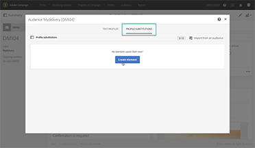
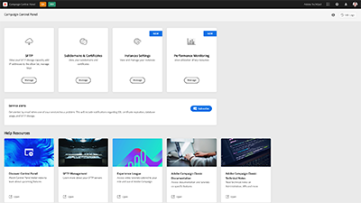
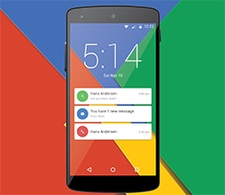

# Adobe Campaign Standard -  Overview

Adobe Campaign provides a platform for designing cross-channel customer experiences and provides an environment for visual campaign orchestration, real time interaction management, and cross channel execution. This user guide contains videos and tutorials on the many features and capabilities of Adobe Campaign Standard.

## What's new

* **[SMPP protocol deep dive and troubleshooting](https://experienceleague.adobe.com/docs/campaign-learn/set-up-sms-for-adobe-campaign/smpp-deep-dive-and-troubleshooting.html)**

  *Learn how SMPP connections are established and how SMPP exchanges data through PDUs. Understand how to troubleshoot connections.*

* **[Control Panel - Monitor workflows](https://experienceleague.adobe.com/docs/control-panel-learn/control-panel/performance-monitoring/monitor-workflows.html){target="_blank"}**
  
  *Learn how to monitor your workflows' temporary storage usage and where to configure workflow settings to avoid database or workflow issues on your instance.*

* **[Control Panel - Monitor throughputs and latency](https://experienceleague.adobe.com/docs/control-panel-learn/control-panel/performance-monitoring/monitor-throughputs-and-latency.html){target="_blank"}**

  *Learn how to monitor delivery throughputs and transactional message latencies of your campaign instance.*

## Staff Picks

<table>
<tr>
  <td>
    
    

      <a href="./communication-channels/email/profile-substitution.md">
    <strong>Profile Substitution - Testing email messages using targeted profiles (video)</strong>
    </a>
    

    

    <em>Learn how to send a proof for review with the exact representation of the message that the profile receives.</em>
    

  </td>
   <td>
    
    

    <a href="https://experienceleague.adobe.com/docs/campaign-standard-learn/control-panel/control-panel-overview.html?lang=en">
    <strong>Control Panel (videos)</strong>
    </a>
    

    

    <em> Increase your efficiency as administrator by managing settings and tracking usages of your instances with the Control Panel .</em>
    

  </td>
  <td>
    
    

      <a href="https://experienceleague.adobe.com/docs/campaign-standard-learn/getting-started-with-push-notifications-android/introduction.html?lang=en">
    <strong>Tutorial: Getting Started with Push Notifications for Android™</strong>
    </a>
    

    

    <em>This tutorial walks you through the steps involved in sending push notifications from Adobe Campaign and receiving these notifications in your Android™ app. </em>
    

  </td>
</tr>
</table>

## Additional resources

* [Documentation](https://experienceleague.adobe.com/docs/campaign-standard/using/campaign-standard-home.html?lang=en)
