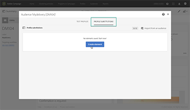
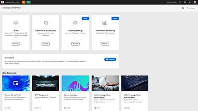

# Adobe Campaign Standard Tutorials

Adobe Campaign provides a platform for designing cross-channel customer experiences and provides an environment for visual campaign orchestration, real time interaction management, and cross-channel execution. This user guide contains videos and tutorials on the many features and capabilities of Adobe Campaign Standard.

## Staff Picks

<table>
<tr>
  <td>
    
    

      <a href="./communication-channels/email/profile-substitution.md">
    <strong>Profile Substitution - Testing email messages using targeted profiles (video)</strong>
    </a>
    

    

    <em>Learn how to send a proof for review with the exact representation of the message that the profile receives.</em>
    

  </td>
   <td>
    
    

    <a href="https://experienceleague.adobe.com/docs/control-panel-learn/tutorials/control-panel-overview.html?lang=en">
    <strong>Control Panel (videos)</strong>
    </a>
    

    

    <em> Increase your efficiency as administrator by managing settings and tracking usages of your instances with the Control Panel .</em>
    

  </td>
  <td>
    
    

      <a href="https://experienceleague.adobe.com/docs/campaign-standard-learn/getting-started-with-push-notifications-android/introduction.html?lang=en">
    <strong>Tutorial: Getting Started with Push Notifications for Android&trade;</strong>
    </a>
    

    

    <em>This tutorial walks you through the steps involved in sending push notifications from Adobe Campaign and receiving these notifications in your Android&trade; app. </em>
    

  </td>
</tr>
</table>

 

