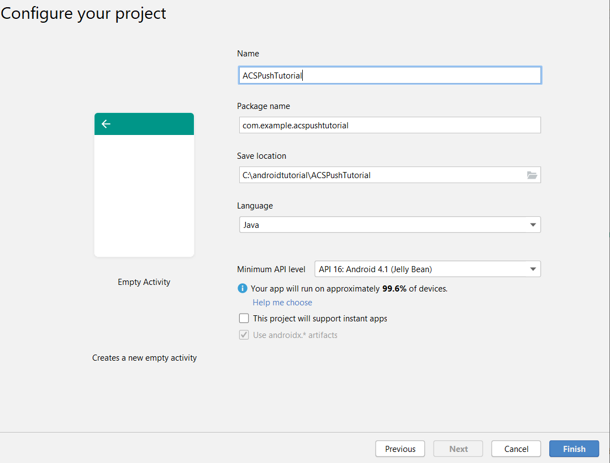

# Step 1 - Creating [!DNL Android] App and configuring to use [!DNL Firebase Cloud Messaging]

In this part you will create [!DNL Android] App to receive [!UICONTROL Push notifications] sent from Adobe Campaign Standard. To receive the push notifications, the app needs to be registered with Google's [!DNL Firebase Cloud Service].

1. Login to your [!DNL Firebase] account.
   
    [!DNL Firebase] is Google's mobile platform that helps you quickly develop high-quality apps. If you do not have a [!DNL Firebase] account, please create one [from here](https://firebase.google.com).

2. Launch [!DNL Android Studio]
3. Click **[!UICONTROL File]** > **[!UICONTROL New]** > **[!UICONTROL New Project].**
4. Select **[!UICONTROL Empty Activity]** and click **[!UICONTROL Next].**

    

5. Provide a meaningful name to the project.

   For the purpose of this demo we have named our project as *[!DNL ACSPushTutorial]*

   

6. Accept the default package names and click **[!DNL Finish]** to create your project.
7. Your project structure should look similar to the screen shot below

    

8. Click **[!UICONTROL Tools]** > **[!UICONTROL Firebase].** (this adds the project to [!DNL Firebase])
9. Click **[!UICONTROL Set up Firebase Cloud Messaging].**

    

10. Click **[!UICONTROL Connect to Firebase].**
11. After your app is connected to Firebase, click **[!UICONTROL Add FCM to your app].**
12. Click **[!UICONTROL Accept Changes].**

    When you are adding FCM to your app, the wizard needs your permission to make some changes to your project.

    ![[!DNL add-fcm-to-your-app]](assets/firebase-add-fcm-to-app.PNG)

On successful integration of your app with Firebase, you should get a message like the one shown below:

 ![[!DNL fcm-successfull]](assets/android-firebase-success.PNG)

[Make sure your project is listed in [!DNL Firebase ]console](https://console.firebase.google.com/)

## Configure [!UICONTROL Push Channel] Settings

1. Login to [!DNL Firebase] console
2. Open the **[!UICONTROL ACSPushTutorial]** project.
3. Click the **gear icon** and open the project settings

    

4. Tab to the **[!UICONTROL Cloud Messaging]** tab. 
5. Copy the server key

    

6. Login to your Adobe Campaign Standard instance
7. Click **[!UICONTROL Adobe Campaign]** > **[!UICONTROL Administration]** > **[!UICONTROL Channels]** > **[!UICONTROL Mobile App].**
8. Select the appropriate **[!UICONTROL Mobile Application Property].**
9. Click the **[!DNL Android] icon** in the **[!UICONTROL Push Channel settings]** section.
10. Paste the server key in the server key field.

If everything goes well you should see a SUCCESS message.

To summarize, we have created an [!DNL Android App] and connected the [!DNL Android App] with [!DNL Firebase]. We then connected the Mobile App in Adobe Campaign with the [!DNL Android App] by pasting the [!DNL Android] App's server key in to the Mobile App in Adobe Campaign Standard.
