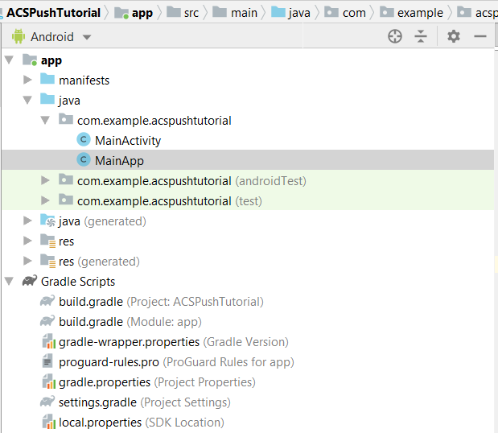

# STEP 2 - Integrate [!UICONTROL Mobile SDK] with Android App

In this part, we will integrate the [!DNL Android] app with [!UICONTROL Mobile SDK]. To integrate [!UICONTROL mobile SDK] with the [!DNL Android] app, please follow the following steps:

* Open the *ACSPushTutorial* project in [!DNL Android Studio]
* Create a new java class called *MainApp* which extends [!DNL android.app.Application]
* Your project structure at this point should look like below



* Expand the [!DNL Gradle Scripts] folder. Double click the [!DNL build.gradle] of the module. Paste the following dependencies in to the dependencies section of the [!DNL build.gradle] file. Your [!DNL build.gradle] file should now look like below

<!--
Removed `{.line-numbers}` below
-->

```java
implementation 'com.adobe.marketing.mobile:campaign:1.+'
implementation 'com.adobe.marketing.mobile:userprofile:1.+'
implementation 'com.adobe.marketing.mobile:sdk-core:1.+'
```


* Sync your [!DNL Android] project by clicking on the sync now button to sync your project

## Modify [!DNL AndroidManifest.xml]{#modify-android-manifest}

Open *AndroidManifest.xml* and paste the following 2 lines after the manifest element and before the application element. This enables your app to communicate with outside world

<!--
Removed `{.line-numbers}` below
-->

```xml
<uses-permission android:name="android.permission.INTERNET" />
<uses-permission android:name="android.permission.ACCESS_NETWORK_STATE" />

```

Copy the following line in the application element
[!DNL android:name=".MainApp"]
Save your [!DNL AndroidManifest.xml]
Your [!DNL AndroidManifest.xml] should look like this

<!--
Removed `{.line-numbers}` below
-->

```xml

<?xml version="1.0" encoding="utf-8"?>
<manifest xmlns:android="http://schemas.android.com/apk/res/android"
    package="com.example.acspushtutorial">
    <uses-permission android:name="android.permission.INTERNET" />
    <uses-permission android:name="android.permission.ACCESS_NETWORK_STATE" />

<application
    android:name=".MainApp"
    android:allowBackup="true"
    android:icon="@mipmap/ic_launcher"
    android:label="@string/app_name"
    android:roundIcon="@mipmap/ic_launcher_round"
    android:supportsRtl="true"
    android:theme="@style/AppTheme">

<activity android:name=".MainActivity">
<intent-filter>
    <action android:name="android.intent.action.MAIN" />
    <category android:name="android.intent.category.LAUNCHER" />
</intent-filter>
</activity>
</application>

</manifest>
```
