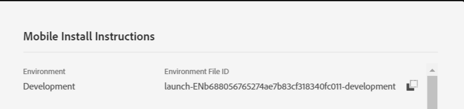

# Step 3 - Register Extensions with your mobile app

In this part, we add the code to register the User Profile, Identity, Lifecycle, and Signal extensions. We must also register the Adobe Campaign Standard extension as shown in the code below.

Open your project in [!DNL Android] studio. Delete the entire code in MainApp **except the first line which is your package statement**.

Paste the following code into MainApp

<!--
Removed `{.line-numbers}` below
-->

```java
import [!DNL android].app.Application;
import android.util.Log;

import com.adobe.marketing.mobile.AdobeCallback;
import com.adobe.marketing.mobile.Campaign;
import com.adobe.marketing.mobile.Identity;
import com.adobe.marketing.mobile.InvalidInitException;
import com.adobe.marketing.mobile.Lifecycle;
import com.adobe.marketing.mobile.LoggingMode;
import com.adobe.marketing.mobile.MobileCore;
import com.adobe.marketing.mobile.Signal;
import com.adobe.marketing.mobile.UserProfile;

public class MainApp extends Application {

@Override
public void onCreate() {
super.onCreate();

MobileCore.setApplication(this);
MobileCore.setLogLevel(LoggingMode.DEBUG);

try{
    Campaign.registerExtension();
    UserProfile.registerExtension();
    Identity.registerExtension();
    Lifecycle.registerExtension();
    Signal.registerExtension();
    MobileCore.start(new AdobeCallback () {
        @Override
        public void call(Object o) {
            MobileCore.configureWithAppID("copy your launch property id here");
        }
    });
} catch (InvalidInitException e) {
    Log.d("ACS Exception", "exception");
}
}
}

```

Line 32 you must provide your[!UICONTROL  Launch] Property's environment file id. This can be accessed from the [!UICONTROL environment tab] of your [!UICONTROL Launch] property.


